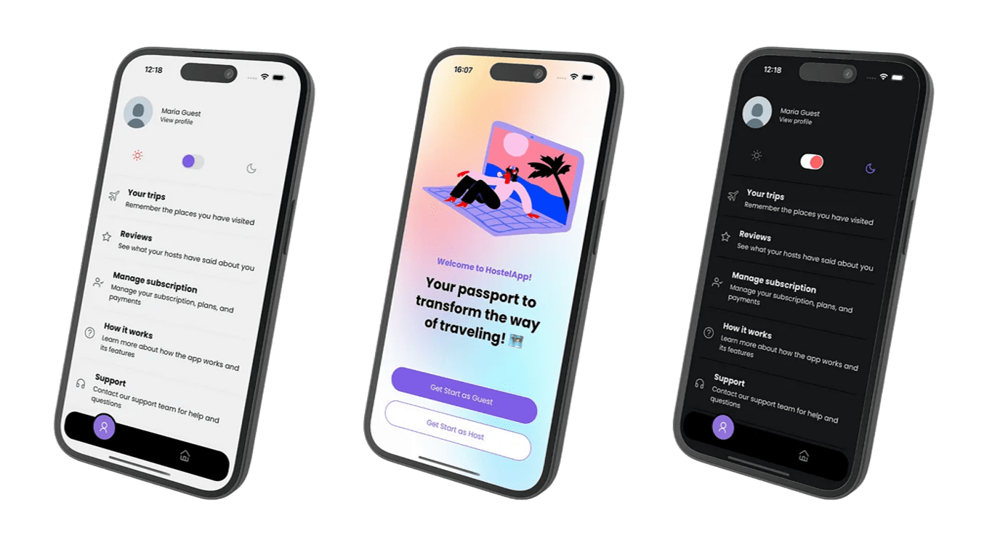

# HostelApp React Native (Expo)
Mobile client for **HostelApp**: browse hostels, rooms, chat in real‑time, and manage your stays. Built with Expo, React Native & TypeScript.




## Case Study

Learn more about the development process, app idea, functional and non-functional requirements in this Medium article I wrote:

https://medium.com/@mariaferreira.developer/case-hostelapp-how-i-built-a-fullstack-mobile-application-d2dbeee99234

⎯⎯⎯⎯⎯⎯⎯

## Backend Service

This client communicates with a **Express.j API**:

- **Repository**: https://github.com/marinspira/hostelapp-express
- **Endpoints**: `/api/auth`, `/api/hostel`, `/api/room`, `/api/reservation` and more.
- **WebSockets**: real‑time messaging via Socket.IO

⎯⎯⎯⎯⎯⎯⎯

## Internal Testing (Google Play)

The app is currently in internal testing on Google Play.

To request access and help with testing, please send an email to **mariaferreira.developer@gmail.com** with your Google account.

You'll receive an invitation to join the internal test track.

⎯⎯⎯⎯⎯⎯⎯

## Tech Stack
- Expo (SDK 52)
- React Native & TypeScript
- Redux Toolkit + Redux Persist
- Socket.IO Client
- react-i18next
- expo-auth-session
- expo-image-picker
- Storybook
- Jest + React Native Testing Library

⎯⎯⎯⎯⎯⎯⎯

## 📂 Project Structure
```text
hostelapp-react-native/
├── .storybook/            # Storybook configuration & stories
├── android/               # Android native project files
├── ios/                   # iOS native project files
├── src/
│   ├── assets/            # Images, fonts, icons
│   ├── components/        # Reusable UI components
│   ├── hooks/             # Custom hooks (useTheme, useFeatureFlag)
│   ├── navigation/        # React Navigation stacks & tabs
│   ├── screens/           # Feature screen components
│   ├── services/          # API & socket clients
│   ├── store/             # Redux slices & store setup
│   ├── theme/             # Color palettes & typography
│   ├── utils/             # Helpers & Type definitions
│   └── App.tsx            # Entry point
├── .env.example           # Environment variables template
├── app.json               # Expo configuration
├── eas.json               # EAS build profiles
├── package.json
└── tsconfig.json
```

⎯⎯⎯⎯⎯⎯⎯

## 📱 Features
**Authentication**  
  - Google Sign‑In (via `expo-auth-session`) and Apple Sign‑In  

**Hostel & Room Browsing**  

**Real‑time Chat**  
  - In‑app messaging powered by `socket.io-client`  

**Theming & Styling**  
  - Dynamic light/dark theme via `useTheme` hook  

**Internationalization**  
  - Multi‑language support with `react-i18next`  

**File Uploads**  
  - Profile pictures via `expo-image-picker`  

**UI Component Catalog**  
  - Storybook setup for isolated component development  
  
**Offline & Caching**  
  - Data persistence with Redux Toolkit & `redux-persist`  